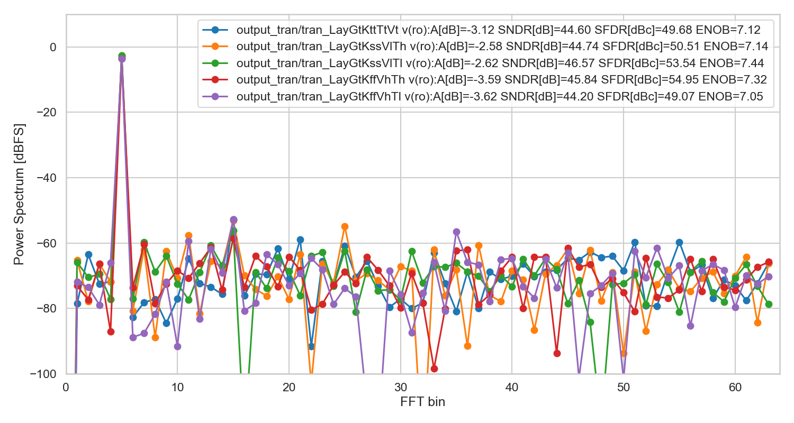

<!---

This file is used to generate your project datasheet. Please fill in the information below and delete any unused
sections.   

You can also include images in this folder and reference them in the markdown. Each image must be less than
512 kb in size, and the combined size of all images must be less than 1 MB.
-->

## Who
Carsten Wulff carsten@wulff.no

## Why
Many years ago I made a compiler, and a state-of-the-art compiled ADC in 28 nm
FDSOI, described in [A Compiled 9-bit 20-MS/s
3.5-fJ/conv.step SAR ADC in 28-nm FDSOI for Bluetooth Low Energy
Receivers](https://ieeexplore.ieee.org/document/7906479). 

Since then, I've
ported the ADC to multiple closed PDKs (22 nm FDSOI, 22 nm, 28 nm, 55 nm, 65 nm and
130nm). A while ago I ported the SAR ADC to Skywater 130nm
[SUN_SAR9B_SKY130NM](https://github.com/wulffern/sun_sar9b_sky130nm/tree/main).

The fact that Tiny Tapeout now includes analog possibility inspired me to try
and see if I could fit the SAR into the Tiny Tapeout area. The original 9-bit ADC did
not fit, so I had to reduce it to 8-bit.

## How to test

Apply a differential voltage with a common mode of around VDD/2 to ua[1] and
ua[0]. If you want to measure the offset and noise of the ADC then connect ua[1]
to ua[0] and provide 0.9 V to both. 

Apply a 4 MHz clock to clk. Typical corner should be able
to run faster.

Set ui\_in[0] high to enable the ADC

The uo\_out[7:0] is two's complement digital output. The MSB is [7].

The ADC will open the input switches to start sampling on the rising edge of the
clock. The ADC will sample on the falling edge of the clock. When clock is low, then the
asynchronous binary search algorithm tries to find the sampled analog input
voltage, and convert the analog value to digital.

The uio\_out[0] is the "done" signal from the asynchronous binary search
algorithm. The digital outputs are sampled on the rising edge of this "done"
signal. 

If you want to capture the output of the ADC with a logic analyzer then
I'd recommend you sample the digital outputs on the falling edge of the "done"
signal. 

Alternatively, you could sample on the rising edge of the clk, however,
any insertion delay between the clk source and the ADC clk has to be taken into
account. 

If there is no "done" signal, then the clock is too fast. 

## How it works

The differential input (ua[1:0]) is sampled onto a capacitor array. When the clk
is high, the input switch is low resistance and the input voltage stabilizes on
the capacitor array. When the clock goes low, the input switch will be high
resistive, and the voltage on the capacitor array is sampled.   

A strong arm comparator decides whether the differential voltage on the
capacitor array is larger or smaller than zero. 

Based on the comparator decision, parts of the capacitor
array is switched from VPWR to VGND, or visa versa. A charge re-distribution
will occur, which changes the differential voltage on the capacitor array. 

A asynchronous custom digital logic performs a binary search to find the digital
value. 

The comparator input has the net name SARP and SARN. Observe those to see how
the SAR operates. 

I would also recommend reading [A Compiled 9-bit 20-MS/s
3.5-fJ/conv.step SAR ADC in 28-nm FDSOI for Bluetooth Low Energy
Receivers](https://ieeexplore.ieee.org/document/7906479), which explains the operation in
detail. 

## Key parameters

| Parameter                | Min | Typ     | Max | Unit |
|:-------------------------|:---:|:-------:|:---:|:----:|
| Technology               |     | SKY130A |     |      |
| AVDD                     | 1.7 | 1.8     | 1.9 | V    |
| Temperature              | -40 | 27      | 125 | C    |
| Sampling frequency (CLK) |     |         | 4   | MHz  |
| Average current VPWR     |     | 48      |     | uA   |
| SNDR\_FS                 |     | 47.7    |     | dBFS |
| SFDR                     |     | 49.7    |     | dBc  |
| ENOB\_FS                 |     | 7.63    |     | bit  |


## Implementation

If you just want to see the layout, then go to
[http://analogicus.com/tt06-sar/](http://analogicus.com/tt06-sar/)

To have a look locally, do the commands below. I assume you have xschem, magic
and the Skywater 130 nm PDK installed. 

``` bash
git clone --recursive git@github.com:wulffern/tt06-sar.git
cd tt06-sar/ip/tt06_sar_sky130nm/work/
xschem -b ../design/TT06_SAR_SKY130NM/tt_um_TT06_SAR_wulffern.sch &
magic ../design/TT06_SAR_SKY130NM/tt_um_TT06_SAR_wulffern.mag &
```

### How to simulate

Install cicsim

```bash
python3 -m pip install cicsim
```

Navigate to the testbench and run a typical simulation (requires cicsim)

```bash 
cd ip/tt06_sar_sky130nm/sim/TT06_SAR
make typical OPT="Debug"
```

The main testbench is `ip/tt06_sar_sky130nm/sim/TT6_06/tran.spi` 


### How to compile

The SAR ADC is made with [ciccreator](https://github.com/wulffern/ciccreator) and
 [cicpy](https://github.com/wulffern/cicpy).
 
The sources for the ADC are

``` bash
ip/sun_sar9b_sky130nm/cic
├── ip.json                      # Object file, describes the object hierarchy of the circuits in the SAR
├── ip.spi                       # Spice file, describes the connectivity 
├── capacitor.json               # Object file for capacitors
├── dmos_sky130nm_core.json      # Object file for transistors
└── sky130.tech                  # Technology file for Skywater 130 nm
```

The SAR is pre-compiled, so you don't really need to compile it. The compiled files are
in the `ip/sun_sar9b_sky130nm/design/` directory.

If you want to try the compilation, then compile `ip/ciccreator` and install `ip/cicpy`, next 

```
cd ip/sun_sar9b_sky130nm/work
make ip
```

### Verification plan 

Testbench folder `ip/TT06_SAR_SKY130NM/sim/TT06_SAR/`

| Purpose                                        | Testbench | corner   | Status | Notes                                 |
|:-----------------------------------------------|:----------|:---------|--------|---------------------------------------|
| SNDR, SFDR, ENOB, active current               | tran      | tfs + C  | OK     | python3 tran.py <runfile> to plot FFT |
|                                                | tran      | typ + RC | Not OK | RC extraction does not work yet       |
| Check power down after 2 sample, clock running | pwrdwn    | typ      | OK     |                                       |


Results at [TT06\_SAR](https://github.com/wulffern/tt06-sar/blob/main/ip/tt06_sar_sky130nm/sim/TT06_SAR/TT06_SAR.md)

Below is a Power Spectrum of a sinusoidal input signal



### Known issues

| Nr | Issue                                 | Solution | Discovery  | Resolved |
|:---|:--------------------------------------|:---------|:-----------|:---------|
| 1  | RC extraction removes coupling caps |          | 2024-04-13 |          |
|    |                                       |          |            |          |

#### 1: RC extraction removes coupling caps 
Extracting R and C seems to remove coupling caps, which removes both the cap in
the bootstrapped switch, and the SAR. As a result, simulations don't work.

I make the RC extracted netlist with

``` bash
cd ip/tt06_sar_sky130nm/work
make lper
```

In that command, I try to match the RC extracted netlist to the schematic
netlist. First I remove all the parasitic Cs, the parasitic Rs and remove the R
nets ( (t|n)\d+ ). The resulting RC extracted netlist is not LVS clean. The m3 resistors in BSSW have been removed.

I've also tried to change all parasitic resistors to 0.1 Ohm (`make lowres`),
but the simulation still does not work.

After a bit of digging it's clear that the cap between XCAP.B and XCAP.A in the
BSSW is gone (it should be 0.3ish pF). There are almost no coupling caps, only
caps to ground.

So I'm resonably sure it's not a real issue. It's a tool issue. Let's see when
the IC comes back.

## External hardware


