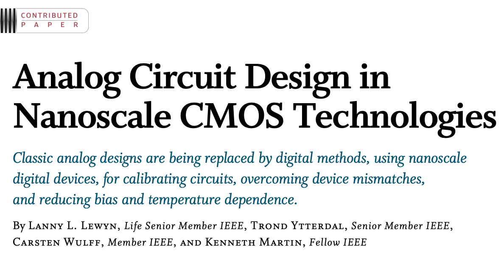
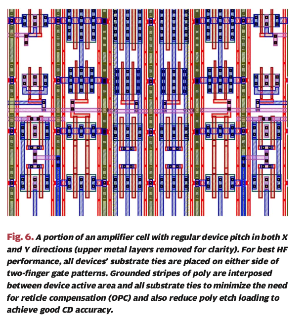
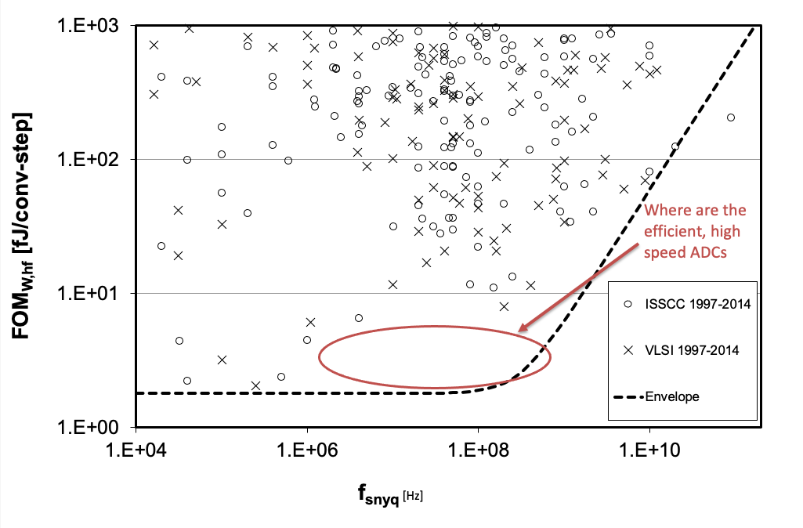
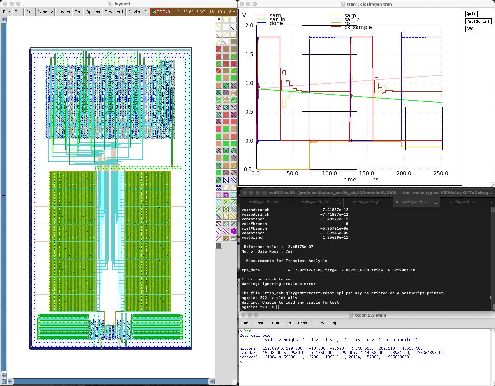
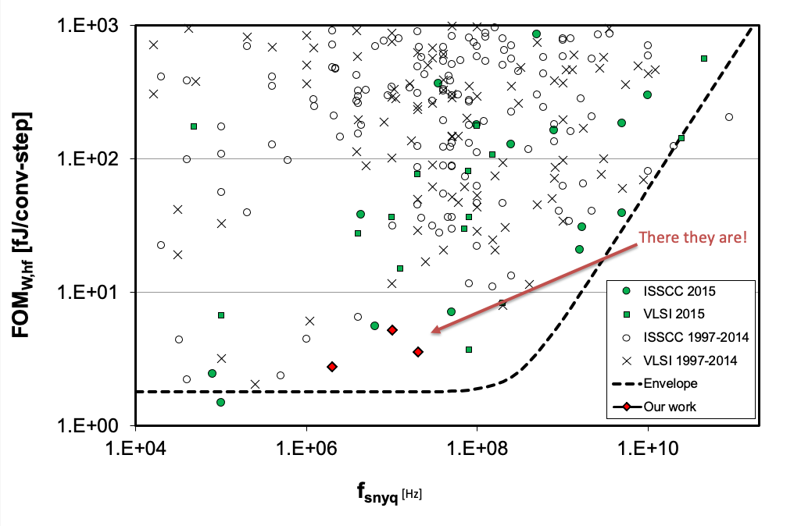

footer: Carsten Wulff 2024
slidenumbers:true
autoscale:true
theme: Plain Jane, 1
text:  Helvetica
header:  Helvetica

# 8-bit SAR ADC on Tiny Tapeout 

# [tt06-sar](https://github.com/wulffern/tt06-sar)

---
# Goal 

Walk you through **tt06-sar**, and the steps necessary to **tapeout** on **TinyTapeout**

---

[.background-color:#000000]
[.text: #FFFFFF]
# Idea

---
#[fit] Trigger (2009)





---
#[fit] Problem (2014)



---

[.background-color:#000000]
[.text: #FFFFFF]
# Circuit 

---


---


---


---


---


---

[.background-color:#000000]
[.text: #FFFFFF]
# Compilation

---


16 k Perl lines. Ported to C++ for speed $$\Rightarrow$$ [ciccreator](https://github.com/wulffern/ciccreator)

---


---


---


---


---


# Since then 

Measured: 28 nm FDSOI, 55 nm 
Ported: 22 nm FDSOI, 22 nm, 28 nm, 65 nm, 130 nm

2022: There is an open source port to skywater 130nm! 
[wulffern/sun\_sar9b\_sky130nm](https://github.com/wulffern/sun_sar9b_sky130nm)



---

# Super simple transistor was a good choice for portability
---

[.column]

```json
//sky130
{ "name" : "DMOS_BULKN" ,
  "class" : "Gds::GdsPatternTransistor",
  "abstract" : 1,
  "yoffset": -0.5,
  "widthoffset" : -0.5,
   "fillCoordinatesFromStrings" : [
       [   "OD",
          "-------------------",
          "----xxx------------",
          "----xxx------------",
          "----xxx------------",
          "-------------------"
      ],
      ...
      [   "M1",
          "----------------xxx",
          "----wDw---------xxx",
          "----------wGw---xBx",
          "----wSw---------xxx",
          "----------------xxx"
      ],
      ...
      [   "NDIFFC",
          "-------------------",
          "----LTR------------",
          "-------------------",
          "----LTR------------",
          "-------------------"
      ]
  ]
}
```

[.column]

```json
//28nm FDSOI
{ "name" : "DMOS" ,
  "class" : "Gds::GdsPatternTransistor",
  "yoffset": -0.5,
  "type": "pch",
  "widthoffset" : -1,
  "fillCoordinatesFromStrings" : [
   [  "OD",
      "------------------xxxx",
      "----xxK-----------xCxC",
      "----xxx-----------xxxx",
      "----xxK-----------xCxC",
      "------------------xxxx"
   ],
   [  "PO",
      "-mmmmmmmmmmmmm--------",
      "----------------------",
      "-mmmmmmmmmmcxc--------",
      "----------------------",
      "-mmmmmmmmmmmmm--------"
   ],
   [  "M1",
      "------------------xxxx",
      "----wDww----------xxxx",
      "-----------wGww---xBxx",
      "----wSww----------xxxx",
      "------------------xxxx"
   ]
  ],
  "afterNew" : {
    "copyColumns" :[
      { "count" : 0, "offset" : 4,"length" : 4}
    ]
  }
}
```

---

[.column]

2016 (Perl compiler)

```json 
{ "name": "SARCMPHX1_CV",
  "description" : "Half a strong-arm comparator",
  "class" : "Layout::LayoutDigitalCell",
  "setYoffsetHalf" :  "" ,
  "rows" : 7,
  "beforeRoute" : {
    "addDirectedRoutes" : [ ["PO","VMR","MN6:G-MP6:G"],
                            ["M1","VMR","MP4:G||MP6:G"],
                            ["M1","CI","MN1:G||MN5:G"],
                            ["M1","N2","MN1:D,MN3:D,MN5:D-|--MP1:D"],
                            ["M1","N1","MN0:D,MN2:D|-MN4:D"],
                            ["M1","N1","MN0:D-|--MP0:S"],
                            ["M1","CO","MP3:D,MP5:D--|-MN6:D"],
                            ["PO","CK","MN0:G-MP0:G"],
                            ["M1","CK","MP0:G,MP1:G-|MP3:G"],
                            ["M4","NC","MP2$:D--|--MP2:G"]
                          ]
    },
    "afterRoute" : {
    "addPortOnRects" : [ ["AVDD","M4" ],
       ["N1","M1","MN4:D"],
       ["N2","M1","MN5:D" ]]
 }
}

```

[.column]

2022 (C++ compiler)

```json 
{ "name": "SARCMPHX1_CV",
  "description" : "Half a strong-arm comparator",
  "class" : "Layout::LayoutDigitalCell",
  "setYoffsetHalf" :  1 ,
  "rows" : 7,
  "meta" : {
       "noSchematic" : true
  },
  "decorator" : [
     {"ConnectSourceDrain" : ["M1","||",""]}
  ],
  "beforeRoute" : {
    "addDirectedRoutes" : [ ["PO","VMR","MN6:G-MP6:G"],
                            ["M1","VMR","MP4:G||MP6:G"],
                            ["M1","CI","MN1:G||MN5:G"],
                            ["M1","N2","MN1:D,MN3:D,MN5:D-|--MP1:D"],
                            ["M1","N1","MN0:D,MN2:D|-MN4:D"],
                            ["M1","N1","MN0:D-|--MP0:S"],
                            ["M1","CO","MP3:D,MP5:D--|-MN6:D"],
                            ["PO","CK","MN0:G-MP0:G"],
                            ["M1","CK","MP0:G,MP1:G-|MP3:G"],
                            ["M4","NC","MP2$:D-|--MP2:G"]
                          ]
    },
    "afterRoute" : {
              "addPortOnRects" : [["BULKP","M1"],
                  ["BULKN","M1"],
                  ["AVDD","M4" ],
                  ["N1","M1","MN4:D"],
                  ["N2","M1","MN5:D" ]]
    }
}

```

---

# Usage is hard, requires a new type of analog designer/programmer

---


---

## [ciccreator](https://github.com/wulffern/ciccreator)

## [ciccreator docs](https://analogicus.com/ciccreator/)

## [cicpy](https://github.com/wulffern/cicpy)

---

[1] [A Compiled 9-bit 20-MS/s 3.5-fJ/conv.step SAR ADC in 28-nm FDSOI for Bluetooth Low Energy Receivers](https://ieeexplore.ieee.org/document/7906479)

[2] [A 68 dB SNDR Compiled Noise-Shaping SAR ADC With On-Chip CDAC
Calibration](https://ieeexplore.ieee.org/document/9056925)


 

---


---

## Things I want to show 

[.column]
- Tiny Tapeout Process
- Schematics
- Layout 
- DRC/LVS

[.column]
- Parasitic extraction
- Verification plan and simulations
- Delivery
- Iteration 

---

#[fit] Thanks!
